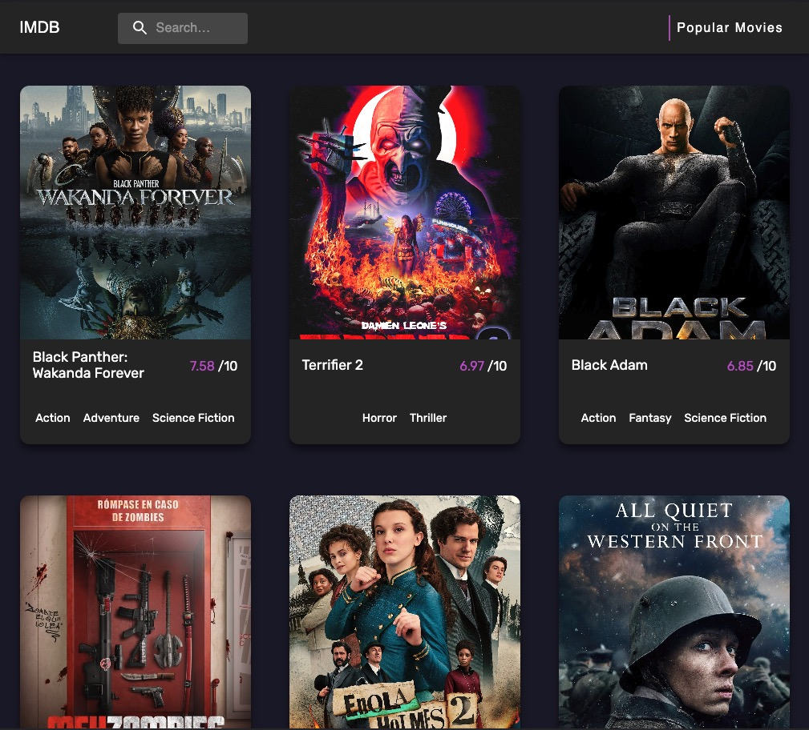
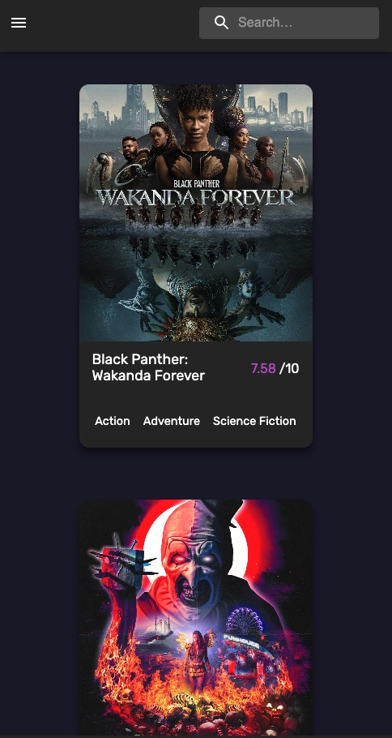

<!-- TABLE OF CONTENTS -->
<details>
  <summary><a id="readme-top">Table of Contents</a></summary>
  <ol>
    <li>
      <a href="#about-the-project">About The Project</a>
      <ul>
        <li><a href="#built-with">Built With</a></li>
      </ul>
    </li>
    <li>
      <a href="#getting-started">Getting Started</a>
      <ul>
        <li><a href="#prerequisites">Prerequisites</a></li>
        <li><a href="#installation">Installation</a></li>
      </ul>
    </li>
    <li><a href="#usage">Usage</a></li>
  </ol>
</details>

# About the Project

<div class="images"> 
    
    
</div>
&nbsp;

<p class="projectDescription"> 
<b>The project itself is about a webb application that can be used to find movies to your liking!</b>
</p>

Here's what it can do:

- You can see the currently popular movies
- You are able to search among the movies available
- You can hover over the movies to have 2 options available for you:
  - You can select the similar option so the application will find the related movies of the selected movie
  - You can see the movie in a detail panel and check it out on imdb or wikipedia if you are further interested

</p>

<p align="right">(<a href="#readme-top">back to top</a>)</p>

### Built With

<div class="builtWithWrapper">
    <div class="imgWrapper">
        
        &nbsp;  Material UI
    </div>
    <br/>
    <div class="imgWrapper">
        
         &nbsp;  Typescript
    </div>
    <br/>
    <div class="imgWrapper">
        
        &nbsp;  Graphql
    </div>
    <br/>
    <div class="imgWrapper">
        
        &nbsp;  Apollo
    </div>
    <br/>
    <div class="imgWrapper">
        
        &nbsp;  React
    </div>
</div>

<p align="right">(<a href="#readme-top">back to top</a>)</p>

<!-- GETTING STARTED -->

## Getting Started

### Prerequisites

First you will need to run the following command in a terminal:

- npm
  ```sh
  npm install npm@latest -g
  ```

### Installation

1. Get a free API Key for the IMDB link to work at [https://rapidapi.com/](https://rapidapi.com/) and find Movie Database Alternative.
2. Subscribe to this API
3. Clone the repo
   ```sh
   git clone https://github.com/kerekesroland/imdb.git
   ```
4. Install NPM packages
   ```sh
   npm install
   ```
5. Create a .env file and enter your API in like this
   ```
   REACT_APP_IMDB_KEY=<YOUR API KEY GOES HERE>
   ```

<p align="right">(<a href="#readme-top">back to top</a>)</p>

<!-- USAGE EXAMPLES -->

## Usage

<p>In a terminal inside the project folder use <b class="highlight">npm start</b> and it will open the application in a new window.</p>
<p>If it doesn't open the application then you will find it if you type <b class="highlight">https://localhost:3000</b> in your browser.</p>
<p>Stay safe, off I go.</p>

<p align="right">(<a href="#readme-top">back to top</a>)</p>
